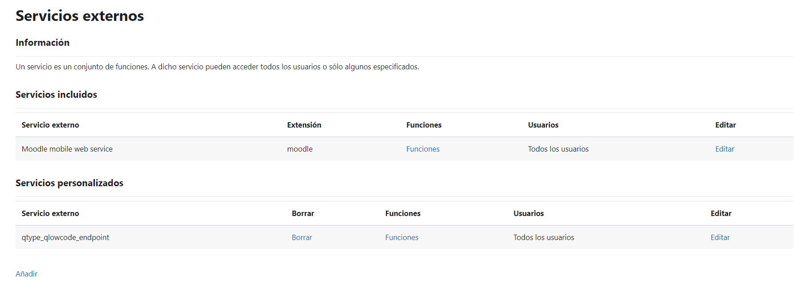
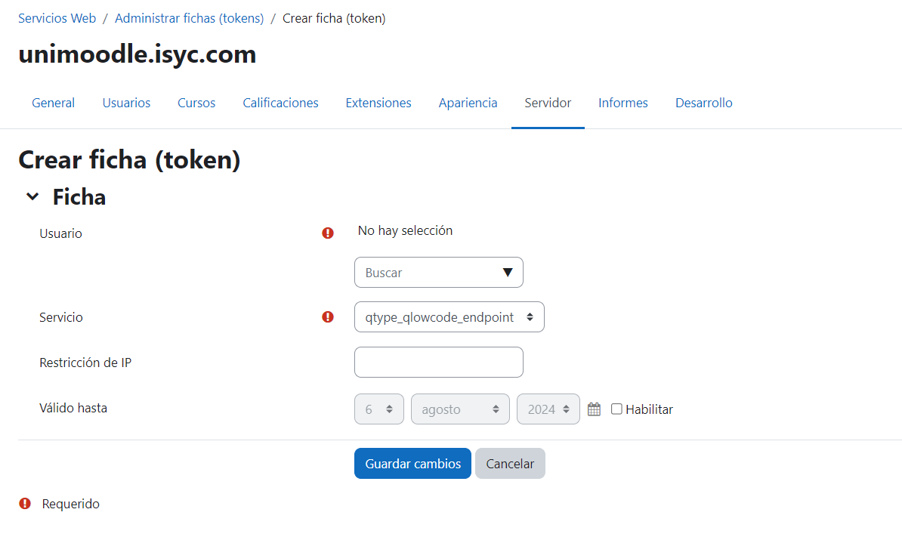
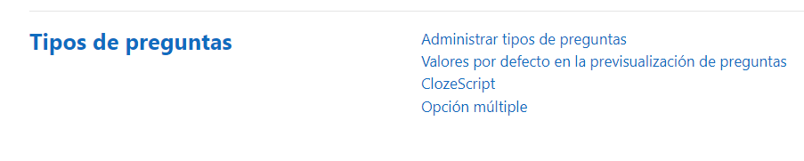
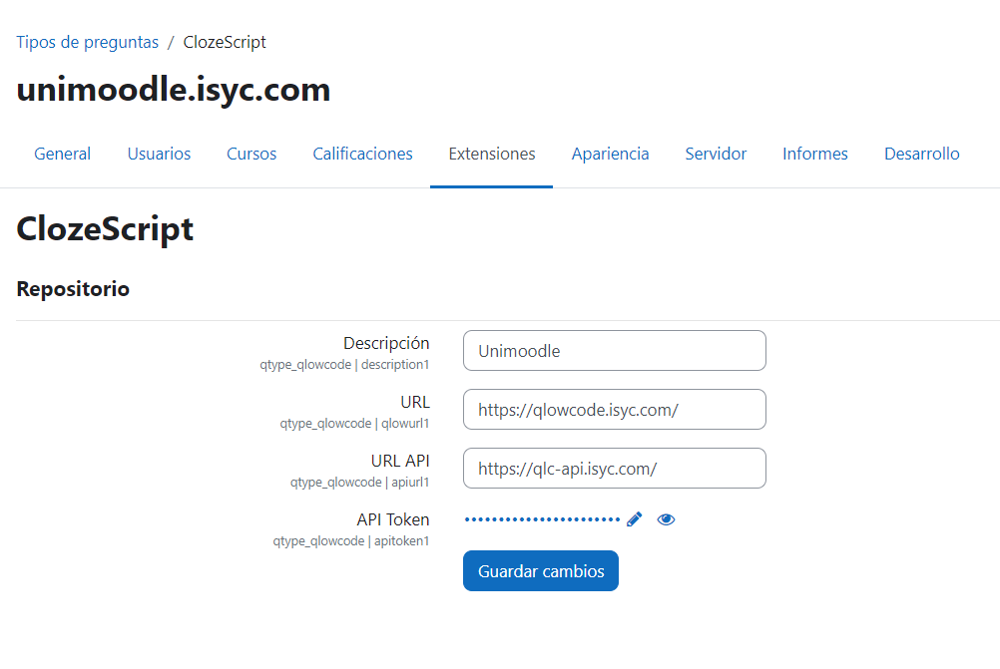
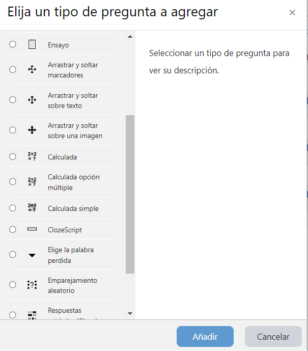
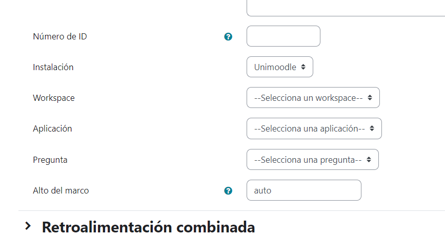
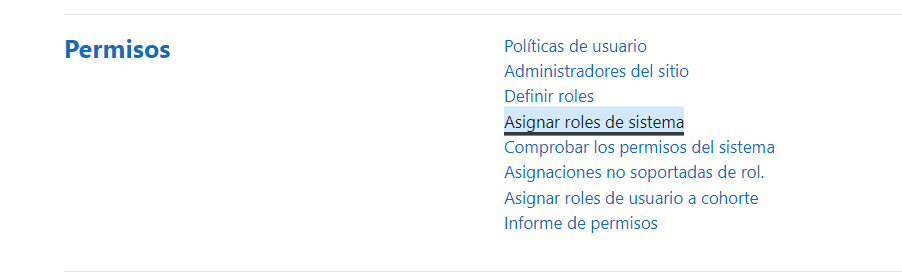
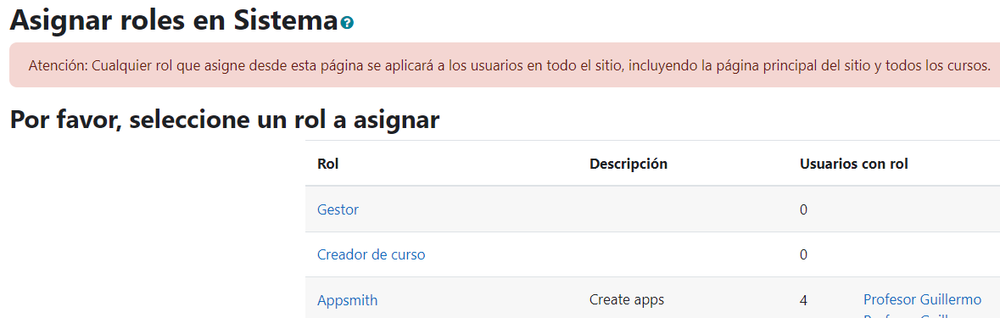

# **CLOZE SCRIPT**

## **GUIA DE USO**

- Información más detallada en https://www.unimoodle.ulpgc.es/index.php?title=Es/qtype/qlowcode

[**INTRODUCCIÓN**](#introducción)

[**INSTALACIÓN**](#instalación)

- [Manual](#manual)

- [Zip](#zip)

[**CONFIGURACIÓN**](#configuracion)

- [Manual](#manual)

[**CREACIÓN PREGUNTA MOODLE**](#creación-pregunta-moodle)

## Introducción

QLowCode es una aplicación desarrollada sobre una plataforma Low code (Appsmith).

Utilizar una plataforma de low-code para la realización de cuestionarios permite a los usuarios diseñar y desplegar rápidamente preguntas y exámenes personalizados, sin requerir un extenso conocimiento de codificación, gracias a la interactividad intuitiva, como el arrastre y soltado.

Utilizamos como lenguaje de programación JavaScript. JavaScript es un lenguaje de programación ampliamente adoptado y considerado accesible debido a su sintaxis intuitiva y flexible, y su amplio uso en el desarrollo web, lo que facilita el aprendizaje para los principiantes y permite una implementación efectiva en diversos contextos.

## Instalación

Hemos desarrollado esta herramienta con el objetivo de proporcionar a los educadores y estudiantes una solución eficaz y sencilla para crear y gestionar preguntas de manera eficiente en el entorno académico.

Gracias a la integración con Appsmith y la potencia de un servidor NODEJS, este sistema no solo es robusto, sino también altamente personalizable, permitiendo adaptarse a diversas necesidades educativas.

Este manual ha sido diseñado para guiarle paso a paso en el proceso de instalación y configuración inicial. Hemos procurado que cada etapa sea clara y concisa, acompañada de instrucciones detalladas para garantizar una experiencia de usuario fluida y sin inconvenientes.

#### Manual
Copiamos la carpeta en la ruta /question/qtype/qlow, y automáticamente al entrar a Moodle como admin nos indicará que quiere instalar el plugin.

#### Zip
Instalar una extensión de tipos de preguntas en Moodle es un proceso bastante similar a instalar cualquier otro plugin en Moodle. 
Aquí tienes una guía paso a paso:
- Descargar la Extensión: Descarga el archivo ZIP de la extensión.
- Iniciar Sesión en Moodle: Accede a tu sitio de Moodle como administrador.
- Ir a la Administración del Sitio: Una vez dentro de Moodle, busca en el menú la sección de “Administración del sitio” (normalmente ubicada en el panel izquierdo o en la parte superior).
- Instalar la Extensión: Navega a Administración del sitio > Plugins > Instalar extensión.
- Aquí, puedes subir el archivo ZIP de la extensión.
- Moodle verificará el archivo y te mostrará una pantalla para confirmar la instalación.
- Instalar y Actualizar la Base de Datos: Sigue las instrucciones en pantalla para completar la instalación. Moodle puede pedirte actualizar la base de datos para incorporar el nuevo tipo de preguntas.

# Configuración

#### API Moodle
- Crear servicio web (https://unimoodle.isyc.com/admin/settings.php?section=externalservices) con la función qtype_qlowcode_endpoint (se genera al instalar el plugin)

- Crear token asociado al servicio web creado anteriormente y a un usuario administrador (https://unimoodle.isyc.com/admin/webservice/tokens.php?action=create)

- Dicho token se usará cuando se instale Appsmith

#### Plugin
- Entra en la página de configuración “Tipo de preguntas” => “ClozeScript”.

- Una vez en la página de configuración se mostrará lo siguiente:

# Creación pregunta Moodle

Para crear una pregunta se debe seleccionar ClozeScript

Se debe elegir el cuestionario y rellenar la pregunta con su identificador de Appsmith:

Apartir de aqui se configuran los parametros de forma habitual.

# Crear usuario de Moodle en Appsmith:

Para acceder a Appsmith con el usuario de Moodle, dicho usuario deberá tener asignado el rol de sistema “Appsmith”, el cual se genera automáticamente durante la instalación del plugin.
Para ello entramos en “Asignar roles de sistema”:

Buscamos el rol Appsmith y le añadiremos los usuarios que se consideren.

Una vez asignados a dicho rol, los usuarios, dentro cada curso verán un acceso a Appsmith/Qlowcode desde aquí:

