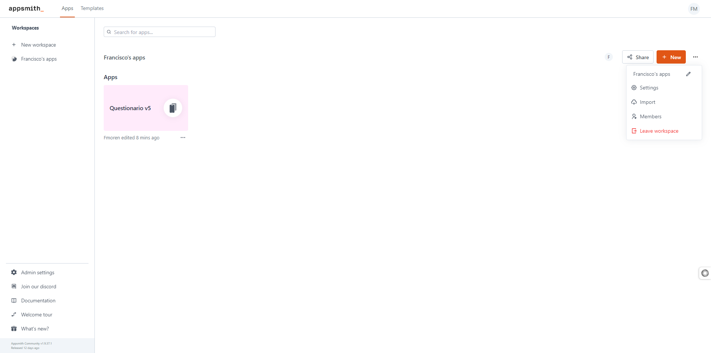
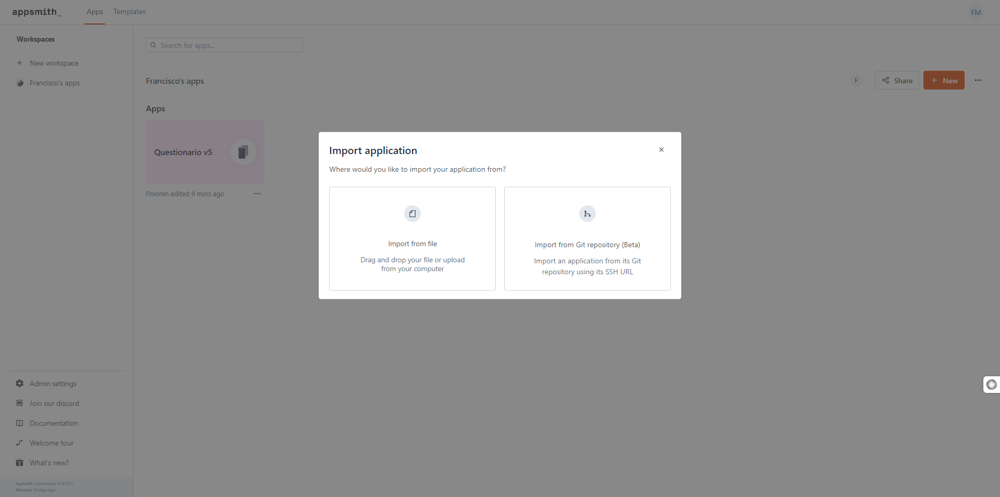
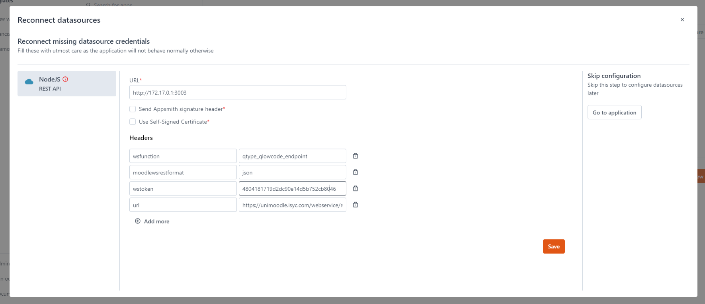
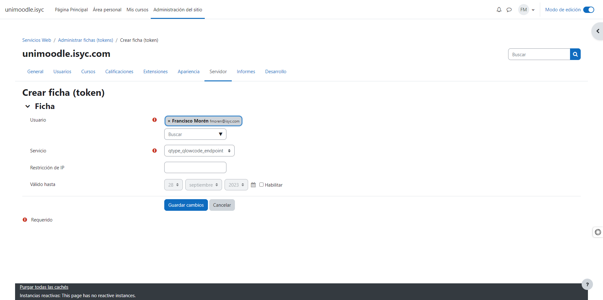
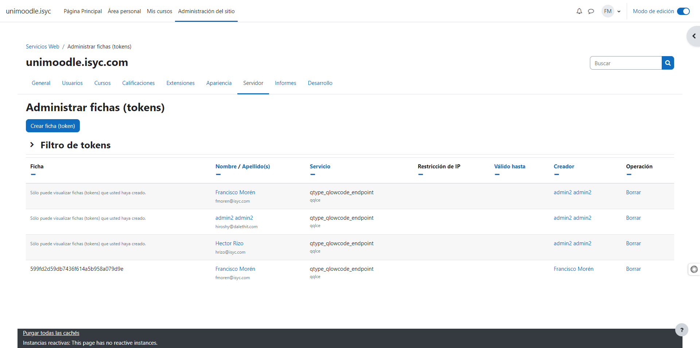
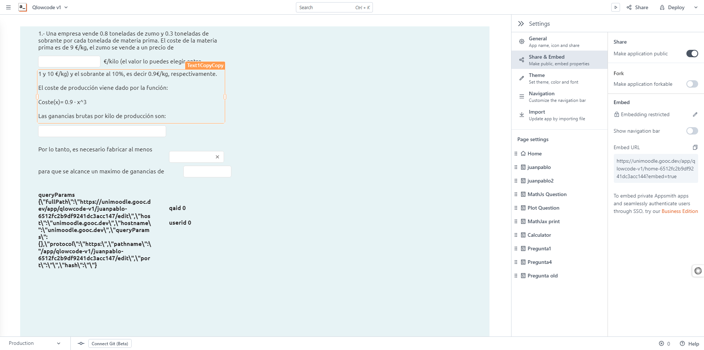
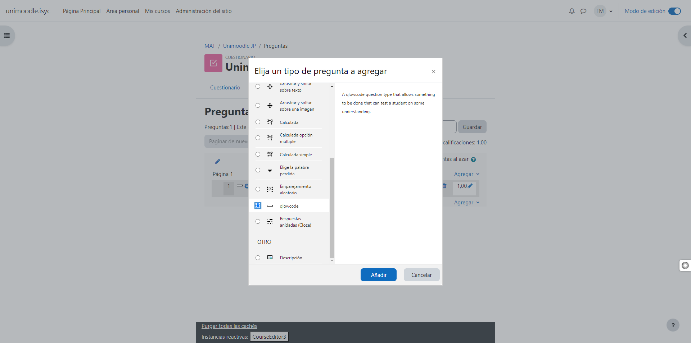
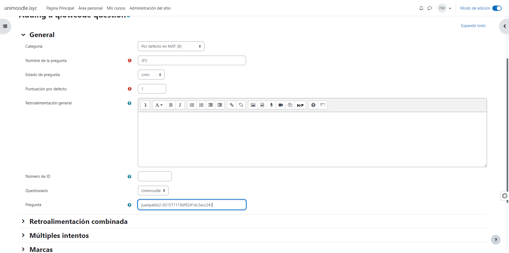

# **CLOZE SCRIPT**


## **GUIA DE USO**


[**INTRODUCCIÓN**](#introducción)

[**INSTALACIÓN**](#instalación)

  - [REQUISITOS PREVIOS](#_bi7pugvn9hh)

  - [FICHERO DOCKER COMPOSE](#_8clo1bizk29d)

  - [EJECUCION FICHERO DOCKER COMPOSE](#_kll30m2k713c)

[**CONFIGURACIÓN**](#configuración)

[**CREACIÓN PREGUNTA MOODLE**](#creación-pregunta-moodle)

## PROPUESTA TÉCNICA

## Introducción

QLowCode es una aplicación desarrollada sobre una plataforma Low code (Appsmith).

Utilizar una plataforma de low-code para la realización de cuestionarios permite a los usuarios diseñar y desplegar rápidamente preguntas y exámenes personalizados, sin requerir un extenso conocimiento de codificación, gracias a la interactividad intuitiva, como el arrastre y soltado.

Utilizamos como lenguaje de programación JavaScript. JavaScript es un lenguaje de programación ampliamente adoptado y considerado accesible debido a su sintaxis intuitiva y flexible, y su amplio uso en el desarrollo web, lo que facilita el aprendizaje para los principiantes y permite una implementación efectiva en diversos contextos.

## Instalación

Hemos desarrollado esta herramienta con el objetivo de proporcionar a los educadores y estudiantes una solución eficaz y sencilla para crear y gestionar preguntas de manera eficiente en el entorno académico.

Gracias a la integración con Appsmith y la potencia de un servidor NODEJS, este sistema no solo es robusto, sino también altamente personalizable, permitiendo adaptarse a diversas necesidades educativas.

Este manual ha sido diseñado para guiarle paso a paso en el proceso de instalación y configuración inicial. Hemos procurado que cada etapa sea clara y concisa, acompañada de instrucciones detalladas para garantizar una experiencia de usuario fluida y sin inconvenientes.

#### REQUISITOS PREVIOS

Tener instalado Docker y Docker Compose en tu máquina. Si no lo tienes, visita [Sitio oficial de Docker](https://docs.docker.com/get-docker/) para instrucciones de instalación.

#### FICHERO DOCKER COMPOSE

````yaml
version: '3.4'

services:
 appsmith:
 image: index.docker.io/appsmith/appsmith-ce
 container\_name: qlowcode\_appsmith3
 ports:
  - "803:80"
  - "1413:443"
  - "19013:9001"
  - "37013:27017"
volumes:
- ./stacks:/appsmith-stacks
restart: unless-stopped
qlowcode:
image: fmoren7/qlowcode:latest
container\_name: qlowcode\_nodejs3
build:
context: server/qlowcode
dockerfile: ./Dockerfile
environment:
NODE\_ENV: production
ports:
 - 3003:3000
````


#### EJECUCION FICHERO DOCKER COMPOSE

Abre la terminal o línea de comandos en la ubicación donde descargaste el docker-compose.yml y ejecuta:

**docker-compose up -d**

Esto iniciará todos los servicios definidos en el fichero, incluyendo Appsmith y el servidor NODEJS.


## Configuración

Una vez que hayas instalado y puesto en marcha Appsmith, accede a la interfaz a través de tu navegador, generalmente en http://localhost:PORT, donde PORT es el puerto definido en tu configuración.

**Pantalla de inicio**

Te encontrarás con una pantalla de bienvenida que te invitará a registrarte o iniciar sesión.

**Proceso de registro**

- Haz clic en el botón "Sign Up" (Registrarse) o "Create Account" (Crear cuenta).
- Introduce tus detalles: esto puede incluir tu dirección de correo electrónico, una contraseña y otros detalles pertinentes que Appsmith pueda requerir.
- Algunas instalaciones pueden ofrecer registro con proveedores de identidad externos (como Google o GitHub), dependiendo de cómo esté configurado Appsmith.
- Haz clic en "Submit" (Enviar) o el botón equivalente para continuar.

**Verificación de correo electrónico (si es aplicable)**

- Dependiendo de la configuración, Appsmith podría enviarte un correo electrónico de verificación. Si es así, dirígete a tu bandeja de entrada y busca un correo electrónico de Appsmith.
- Haz clic en el enlace proporcionado en el correo electrónico para verificar tu dirección y activar tu cuenta.

**Inicio de sesión**

Una vez que hayas completado el proceso de registro (y la verificación, si se requiere), podrás iniciar sesión utilizando las credenciales que proporcionaste.

**Primeros pasos después del registro**

Tras el registro e inicio de sesión exitoso, serás dirigido al dashboard de Appsmith, donde puedes comenzar a crear nuevas aplicaciones.

**Creacion aplicacion**

Subir la aplicacion, pulsando en import:



Seleccionar import from file:



Selecciona la aplicación que deseas subir

Haz clic en la aplicación que quieras subir para abrirla.

El la siguiente pantalla rellenar la siguiente informacion:



wsfunction: qtype\_qlowcode\_endpoint

moodlewsrestformat: json

wstocken: 4804181719d2d4d5b752cb80e46

url: https://unimoodle.isyc.com/webservice/rest/server.php

Moodle, ofrece una API para permitir la integración y el acceso programático a sus funciones. A continuación, te describo cada uno de los parámetros que has proporcionado:

- **wsfunction** :
  - Descripción: Este es el nombre de la función del servicio web que deseas llamar. Moodle tiene muchas funciones de servicio web predefinidas que puedes invocar, y cada una corresponde a diferentes operaciones que puedes realizar en la plataforma.
  - Valor que proporcionaste: qtype\_qlowcode\_endpoint. Este valor es fijo y apunta al servicio web the qlowcode.
- **moodlewsrestformat** :
  - Descripción: Especifica el formato de datos en el que deseas recibir la respuesta del servidor. Moodle generalmente soporta formatos como XML y JSON.
  - Valor que proporcionaste: json. Siempre fijo. Esto indica que las respuestas del servicio web se entregan en formato JSON, que es un formato de datos ligero y fácil de leer tanto para humanos como para máquinas.
- **wstoken** :
  - Descripción: Es el token de seguridad que se utiliza para autenticar tu solicitud al servicio web de Moodle. Cada usuario o servicio que interactúa con la API de Moodle necesita un token único para garantizar que tiene los permisos adecuados para realizar la operación solicitada.
  - Valor que proporcionaste: 4804181719d2d4d5b752cb80e46. Este valor debe sustituirse por el que haya configurado en Moodle:





- **url** :
  - Descripción: Es la dirección URL del punto final del servicio web de Moodle al que deseas conectarte.
  - Valor que proporcionaste: https://unimoodle.isyc.com/webservice/rest/server.php. Esta es la URL base de tu instalación de Moodle a la que enviarás tus solicitudes API. Sustituye el dominio por el tuyo.

Nota: Asegúrate siempre de no compartir tokens o credenciales sensibles en foros públicos o con personas no autorizadas para proteger la seguridad y privacidad de tu sistema.

**Publicación de la aplicación**

Dentro de la interfaz de edición de la aplicación, busca un botón o una opción que diga "Deploy" o "Publicar". Al hacer clic en esta opción, Appsmith "subirá" tu aplicación, es decir, la moverá de un estado de desarrollo a un estado en el que puede ser vista y utilizada por otros usuarios.

**Compartir tu aplicación**

Una vez que tu aplicación esté publicada, Appsmith generalmente te proporcionará una URL o un enlace que puedes compartir con otros usuarios. Esta URL llevará a la versión "en vivo" de tu aplicación.

**Gestión de acceso**

Appsmith permite configurar el acceso a tu aplicación. Puedes establecer si deseas que todos los usuarios con el enlace puedan acceder a la aplicación o si prefieres restringir el acceso solo a ciertos usuarios. En este caso elegiremos acceso publico.



# Creación pregunta Moodle

Para crear una pregunta se debe seleccionar qlowcode



Se debe elegir el cuestionario y rellenar la pregunta con su identificador de Appsmith:



Apartir de aqui se configuran los parametros de forma habitual.
